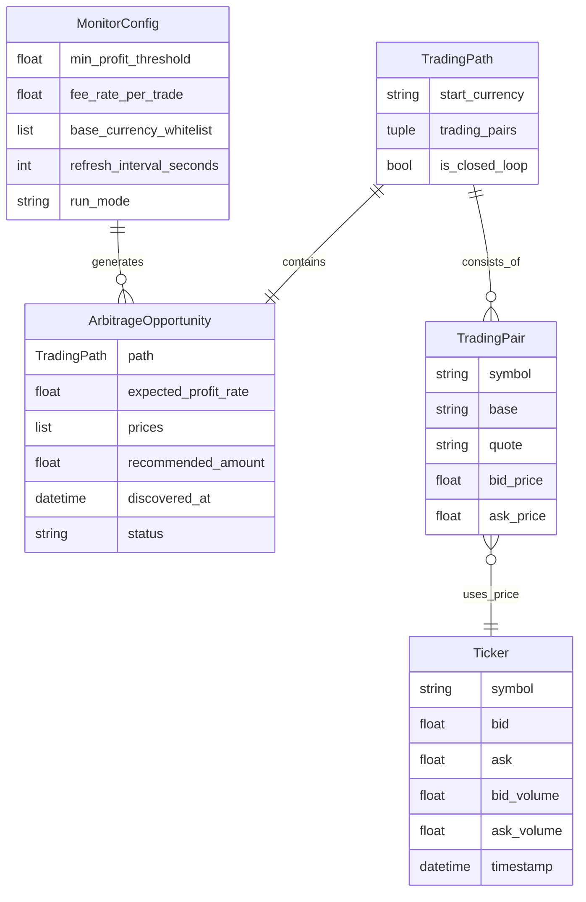

# Data Model: 三角套利机会监测系统

**Feature**: 004-xt-get-ticker
**Date**: 2025-10-06
**Purpose**: 定义所有数据实体、关系和验证规则

---

## 实体概览



---

## 实体定义

### 1. MonitorConfig (监控配置)

**用途**: 系统运行配置参数（FR-017, FR-018）

**字段**:

| 字段名 | 类型 | 必需 | 默认值 | 验证规则 | 说明 |
|--------|------|------|--------|----------|------|
| `min_profit_threshold` | `float` | ✅ | `0.5` | `>= 0.0, <= 100.0` | 最低盈利阈值（百分比） |
| `fee_rate_per_trade` | `float` | ✅ | `0.1` | `>= 0.0, <= 10.0` | 每笔交易手续费率（百分比） |
| `base_currency_whitelist` | `list[str]` | ❌ | `[]` | 每个货币必须为大写字母 | 基础货币白名单（空=全部） |
| `refresh_interval_seconds` | `int` | ✅ | `10` | `>= 1, <= 3600` | 刷新间隔（秒，实时模式） |
| `run_mode` | `str` | ✅ | `"once"` | `"once" | "realtime"` | 运行模式 |

**状态转换**: 无（配置不可变，immutable Pydantic model）

**关系**:
- 生成 `ArbitrageOpportunity`（一对多）

**验证规则** (FR-018):
```python
from pydantic import BaseModel, Field, validator

class MonitorConfig(BaseModel, frozen=True):
    min_profit_threshold: float = Field(default=0.5, ge=0.0, le=100.0)
    fee_rate_per_trade: float = Field(default=0.1, ge=0.0, le=10.0)
    base_currency_whitelist: list[str] = Field(default_factory=list)
    refresh_interval_seconds: int = Field(default=10, ge=1, le=3600)
    run_mode: str = Field(default="once", pattern="^(once|realtime)$")

    @validator("base_currency_whitelist", each_item=True)
    def validate_currency(cls, v):
        if not v.isupper() or not v.isalpha():
            raise ValueError(f"Currency must be uppercase letters: {v}")
        return v
```

---

### 2. TradingPath (交易路径)

**用途**: 表示一条完整的三角套利路径（A→B→C→A）

**字段**:

| 字段名 | 类型 | 必需 | 验证规则 | 说明 |
|--------|------|------|----------|------|
| `start_currency` | `str` | ✅ | 大写字母 | 起始货币（如 USDT） |
| `trading_pairs` | `tuple[str, str, str]` | ✅ | 长度=3 | 三个交易对符号（顺序） |
| `is_closed_loop` | `bool` | ✅ | 计算属性 | 是否回到起始货币 |

**计算属性**:
- `is_closed_loop`: 验证第三步交易后回到 `start_currency`

**验证规则**:
```python
from pydantic import BaseModel, validator

class TradingPath(BaseModel, frozen=True):
    start_currency: str
    trading_pairs: tuple[str, str, str]

    @property
    def is_closed_loop(self) -> bool:
        # 解析第三个交易对，检查是否回到 start_currency
        # 实现逻辑: 根据交易方向判断最终货币
        pass

    @validator("start_currency")
    def validate_currency(cls, v):
        if not v.isupper() or not v.isalpha():
            raise ValueError(f"Currency must be uppercase: {v}")
        return v

    @validator("trading_pairs")
    def validate_path_length(cls, v):
        if len(v) != 3:
            raise ValueError("Trading path must have exactly 3 pairs")
        return v
```

---

### 3. ArbitrageOpportunity (套利机会)

**用途**: 表示一条符合条件的套利机会（FR-010, FR-011）

**字段**:

| 字段名 | 类型 | 必需 | 验证规则 | 说明 |
|--------|------|------|----------|------|
| `path` | `TradingPath` | ✅ | - | 套利路径 |
| `expected_profit_rate` | `Decimal` | ✅ | - | 预期收益率（%，已扣除手续费） |
| `prices` | `list[dict]` | ✅ | 长度=3 | 各环节价格详情（type, pair, price） |
| `recommended_amount` | `Decimal` | ✅ | `> 0` | 建议初始投资金额 |
| `discovered_at` | `datetime` | ✅ | - | 发现时间戳 |
| `status` | `str` | ✅ | enum | 状态（new/printed/expired） |

**prices 结构** (FR-010):
```python
[
    {"type": "buy", "pair": "BTC/USDT", "price": 50000.0},  # Step 1
    {"type": "buy", "pair": "ETH/BTC", "price": 0.05},      # Step 2
    {"type": "sell", "pair": "ETH/USDT", "price": 2600.0}   # Step 3
]
```

**状态转换**:
```
new → printed (打印到控制台后)
new/printed → expired (价格更新后失效)
```

**验证规则**:
```python
from pydantic import BaseModel, validator
from decimal import Decimal
from datetime import datetime

class ArbitrageOpportunity(BaseModel):
    path: TradingPath
    expected_profit_rate: Decimal
    prices: list[dict]
    recommended_amount: Decimal = Field(gt=0)
    discovered_at: datetime = Field(default_factory=datetime.utcnow)
    status: str = Field(default="new", pattern="^(new|printed|expired)$")

    @validator("prices")
    def validate_prices_length(cls, v):
        if len(v) != 3:
            raise ValueError("Prices must contain exactly 3 entries")
        for price in v:
            if not all(k in price for k in ["type", "pair", "price"]):
                raise ValueError("Each price must have type, pair, price")
        return v
```

---

### 4. MarketPrice (市场价格)

**用途**: 表示某个交易对的实时价格（复用 Feature 003 的 Ticker）

**复用关系**:
- **直接使用** `tri_arb.models.exchange.Ticker` (Feature 003)
- 无需新建实体，避免数据重复

**使用方式**:
```python
from tri_arb.models.exchange import Ticker

# 从 get_ticker() 获取
tickers: list[Ticker] = await exchange.get_ticker(None)

# 过滤无效价格 (FR-002)
valid_tickers = [
    t for t in tickers
    if t.bid > 0 and t.ask > 0 and t.bid < t.ask
]
```

---

## 实体关系

### 1. MonitorConfig → ArbitrageOpportunity
- **类型**: 一对多（One-to-Many）
- **说明**: 一个配置生成多个套利机会
- **实现**: `MonitorConfig` 传递给路径发现和计算模块

### 2. TradingPath ↔ ArbitrageOpportunity
- **类型**: 一对一（One-to-One）
- **说明**: 每个套利机会包含一条唯一路径
- **实现**: `ArbitrageOpportunity.path: TradingPath`

### 3. TradingPath → TradingPair (逻辑关系)
- **类型**: 一对三（One-to-Three）
- **说明**: 每条路径由 3 个交易对组成
- **实现**: `TradingPath.trading_pairs: tuple[str, str, str]`（存储符号，不存储完整对象）

### 4. TradingPair → Ticker (逻辑关系)
- **类型**: 多对一（Many-to-One）
- **说明**: 多个交易对可能引用同一个 Ticker（不同方向）
- **实现**: 通过 `symbol` 字符串关联，不建立对象引用

---

## 数据验证规则总结

### 输入验证 (FR-018)
1. **MonitorConfig**:
   - `min_profit_threshold`: 0-100%
   - `fee_rate_per_trade`: 0-10%
   - `refresh_interval_seconds`: 1-3600s
   - `run_mode`: 只能是 "once" 或 "realtime"
   - `base_currency_whitelist`: 每个货币必须大写字母

2. **TradingPath**:
   - `start_currency`: 大写字母
   - `trading_pairs`: 必须包含 3 个交易对
   - `is_closed_loop`: 必须为 True（闭环路径）

3. **ArbitrageOpportunity**:
   - `prices`: 必须包含 3 个价格条目
   - `recommended_amount`: 必须 > 0
   - `status`: 只能是 "new", "printed", "expired"

### 业务规则验证 (FR-002, FR-006, FR-007)
1. **价格有效性** (FR-002):
   ```python
   def is_valid_price(ticker: Ticker) -> bool:
       return (
           ticker.bid > 0 and
           ticker.ask > 0 and
           ticker.bid < ticker.ask
       )
   ```

2. **路径筛选** (FR-006):
   ```python
   def should_include_path(path: TradingPath, whitelist: list[str]) -> bool:
       if not whitelist:
           return True  # 空白名单=包含所有
       return path.start_currency in whitelist
   ```

3. **机会筛选** (FR-007, FR-008):
   ```python
   def should_print(opp: ArbitrageOpportunity, threshold: float) -> bool:
       return opp.expected_profit_rate >= threshold
   ```

---

## 不可变性保证

**原则**: 所有数据模型使用 Pydantic `frozen=True`，确保不可变性（Constitution Principle I）

```python
class MonitorConfig(BaseModel, frozen=True): ...
class TradingPath(BaseModel, frozen=True): ...
class ArbitrageOpportunity(BaseModel): ...  # status 可变
```

**理由**:
- `MonitorConfig` 和 `TradingPath`: 完全不可变（配置和路径不应改变）
- `ArbitrageOpportunity`: 允许状态转换（new → printed），但其他字段不可变

---

*Generated by Phase 1 design*
