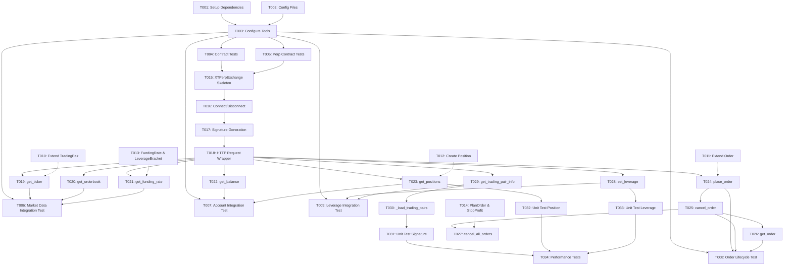

# Tasks: XT Perpetual Futures API Integration

**Feature**: 008-xt-perp-api | **Branch**: `008-xt-perp-api` | **Date**: 2025-10-11
**Input**: Design documents from `/specs/008-xt-perp-api/`
**Prerequisites**: plan.md ✅ | research.md ✅ | data-model.md ✅ | contracts/ ✅ | quickstart.md ✅

## Task Summary

**Total Tasks**: 34
**Parallel Tasks**: 15 tasks marked [P]
**Sequential Tasks**: 19 tasks
**Estimated Time**: 8-12 hours (with parallelization)

## Format: `[ID] [P?] Description`
- **[P]**: Can run in parallel (different files, no dependencies)
- All file paths are absolute from repository root

---

## Phase 3.1: Setup & Prerequisites

- [x] **T001** 检查项目依赖并安装必要的包
  - **Path**: `pyproject.toml`
  - **Action**: 验证 httpx, pydantic, tenacity, pytest-asyncio, respx 已安装
  - **Command**: `uv pip install httpx pydantic tenacity pytest-asyncio respx`
  - **Validation**: `uv pip list | grep -E 'httpx|pydantic|tenacity|pytest-asyncio|respx'`

- [x] **T002** 创建 XT 永续合约专用配置
  - **Path**: `.env.example`
  - **Action**: 添加 `XT_PERP_API_KEY` 和 `XT_PERP_API_SECRET` 环境变量示例
  - **Validation**: 文件包含永续合约 API 配置注释

- [x] **T003** [P] 配置 mypy 和 ruff 检查永续合约模块
  - **Path**: `pyproject.toml`, `ruff.toml`
  - **Action**: 确保 `src/tri_arb/exchanges/xt_perp.py` 和 `src/tri_arb/models/perpetual.py` 在检查范围内
  - **Validation**: `uv run mypy src/tri_arb/exchanges/ --strict` 无错误

---

## Phase 3.2: Tests First (TDD) ⚠️ MUST COMPLETE BEFORE 3.3

**CRITICAL**: 这些测试必须先编写并且必须失败，然后才能开始任何实现。

### Contract Tests (BaseExchange Interface Compliance)

- [x] **T004** [P] 创建 XTPerpExchange 合约测试骨架
  - **Path**: `tests/unit/test_exchanges/test_xt_perp_contract.py`
  - **Action**: 创建测试类 `TestXTPerpExchangeContract`，继承 BaseExchange 接口测试
  - **Tests**:
    - `test_implements_base_exchange_interface()` - 验证 XTPerpExchange 实现所有必需方法
    - `test_connect_disconnect_lifecycle()` - 测试连接生命周期
    - `test_get_ticker_signature()` - 测试 get_ticker() 方法签名
    - `test_get_orderbook_signature()` - 测试 get_orderbook() 方法签名
    - `test_place_order_signature()` - 测试 place_order() 方法签名
    - `test_cancel_order_signature()` - 测试 cancel_order() 方法签名
    - `test_get_balance_signature()` - 测试 get_balance() 方法签名
  - **Expected**: 所有测试失败（XTPerpExchange 尚未实现）
  - **Validation**: `uv run pytest tests/unit/test_exchanges/test_xt_perp_contract.py -v` 所有测试失败

- [x] **T005** [P] 创建永续合约特有方法的合约测试
  - **Path**: `tests/unit/test_exchanges/test_xt_perp_contract.py`
  - **Action**: 在同一测试文件添加永续合约特定方法测试
  - **Tests**:
    - `test_get_positions_signature()` - 测试 get_positions() 方法签名
    - `test_get_funding_rate_signature()` - 测试 get_funding_rate() 方法签名
    - `test_set_leverage_signature()` - 测试 set_leverage() 方法签名
    - `test_place_order_with_position_side()` - 测试订单包含 position_side 参数
    - `test_cancel_all_orders_signature()` - 测试 cancel_all_orders() 方法签名
  - **Expected**: 所有测试失败
  - **Validation**: `uv run pytest tests/unit/test_exchanges/test_xt_perp_contract.py::TestXTPerpExchangeContract::test_get_positions_signature -v` 失败

### Integration Test Scenarios

- [ ] **T006** [P] 集成测试：获取市场数据
  - **Path**: `tests/integration/test_xt_perp_integration.py`
  - **Action**: 创建集成测试用例 `test_fetch_market_data_integration()`
  - **Scenario**: 连接 → 获取 BTC/USDT ticker → 获取 orderbook → 获取 funding rate → 断开
  - **Tests**:
    - 验证 ticker 包含 last_price, bid, ask
    - 验证 orderbook 包含 bids, asks 列表
    - 验证 funding_rate 包含 rate, next_funding_time
  - **Mark**: `@pytest.mark.integration` 和 `@pytest.mark.asyncio`
  - **Expected**: 测试失败（XTPerpExchange 未实现）
  - **Validation**: `uv run pytest tests/integration/test_xt_perp_integration.py::test_fetch_market_data_integration --run-integration -v` 失败

- [ ] **T007** [P] 集成测试：账户和持仓查询
  - **Path**: `tests/integration/test_xt_perp_integration.py`
  - **Action**: 创建集成测试用例 `test_account_and_positions_integration()`
  - **Scenario**: 连接 → 获取账户余额 → 获取当前持仓 → 验证数据结构 → 断开
  - **Tests**:
    - 验证 balance 包含 available, frozen 字典
    - 验证 positions 列表中每个 Position 包含必需字段
  - **Mark**: `@pytest.mark.integration` 和 `@pytest.mark.asyncio`
  - **Expected**: 测试失败
  - **Validation**: 同上

- [ ] **T008** [P] 集成测试：完整订单生命周期
  - **Path**: `tests/integration/test_xt_perp_integration.py`
  - **Action**: 创建集成测试用例 `test_order_lifecycle_integration()`
  - **Scenario**: 连接 → 下限价单 (开多) → 查询订单 → 取消订单 → 验证状态 → 断开
  - **Tests**:
    - 验证下单返回 Order 对象
    - 验证查询订单返回正确状态
    - 验证取消订单成功
  - **Mark**: `@pytest.mark.integration` 和 `@pytest.mark.asyncio`
  - **Expected**: 测试失败
  - **Validation**: 同上

- [ ] **T009** [P] 集成测试：杠杆管理
  - **Path**: `tests/integration/test_xt_perp_integration.py`
  - **Action**: 创建集成测试用例 `test_leverage_management_integration()`
  - **Scenario**: 连接 → 设置杠杆为 10x → 获取交易对信息验证杠杆 → 断开
  - **Tests**:
    - 验证 set_leverage() 成功
    - 验证 get_trading_pair_info() 返回正确的杠杆倍数
  - **Mark**: `@pytest.mark.integration` 和 `@pytest.mark.asyncio`
  - **Expected**: 测试失败
  - **Validation**: 同上

---

## Phase 3.3: Core Implementation (ONLY after tests are failing)

### Data Models

- [x] **T010** [P] 扩展 TradingPair 模型
  - **Path**: `src/tri_arb/models/trading.py`
  - **Action**: 在现有 TradingPair 模型添加永续合约字段
  - **Fields to Add**:
    - `leverage_brackets: list[LeverageBracket] = field(default_factory=list)`
    - `contract_size: Decimal | None = None`
    - `contract_type: Literal["PERPETUAL"] | None = None`
  - **Validation**: `uv run mypy src/tri_arb/models/trading.py --strict` 无错误

- [x] **T011** [P] 扩展 Order 模型
  - **Path**: `src/tri_arb/models/trading.py`
  - **Action**: 在现有 Order 模型添加永续合约字段和方法
  - **Fields to Add**:
    - `position_side: Literal["LONG", "SHORT"] | None = None`
    - `time_in_force: Literal["GTC", "IOC", "FOK", "POST_ONLY"] | None = "GTC"`
  - **Property to Add**:
    - `trade_action` property: 根据 `side` 和 `position_side` 返回 "OPEN_LONG" | "CLOSE_LONG" | "OPEN_SHORT" | "CLOSE_SHORT"
  - **Validation**: `uv run mypy src/tri_arb/models/trading.py --strict` 无错误

- [x] **T012** [P] 创建 Position 模型
  - **Path**: `src/tri_arb/models/perpetual.py` (新文件)
  - **Action**: 创建 Position dataclass
  - **Fields**:
    - `symbol: str`, `side: Literal["LONG", "SHORT"]`, `quantity: Decimal`
    - `entry_price: Decimal`, `mark_price: Decimal`, `liquidation_price: Decimal`
    - `unrealized_pnl: Decimal`, `leverage: int`, `margin: Decimal`, `roe: Decimal`
  - **Validation**: `uv run mypy src/tri_arb/models/perpetual.py --strict` 无错误

- [x] **T013** [P] 创建 FundingRate 和 LeverageBracket 模型
  - **Path**: `src/tri_arb/models/perpetual.py`
  - **Action**: 创建 FundingRate 和 LeverageBracket dataclass
  - **FundingRate Fields**: `symbol: str`, `rate: Decimal`, `next_funding_time: datetime`
  - **LeverageBracket Fields**: `min_notional: Decimal`, `max_notional: Decimal`, `max_leverage: int`
  - **Validation**: 同上

- [x] **T014** [P] 创建 PlanOrder 和 StopProfit 模型
  - **Path**: `src/tri_arb/models/perpetual.py`
  - **Action**: 创建条件单相关 dataclass
  - **PlanOrder Fields**: `order_id: str`, `symbol: str`, `trigger_price: Decimal`, `order_type: str`, 等
  - **StopProfit Fields**: `trigger_price: Decimal`, `order_price: Decimal | None`, `order_type: str`
  - **Validation**: 同上

### Core Adapter Implementation

- [x] **T015** 创建 XTPerpExchange 类骨架
  - **Path**: `src/tri_arb/exchanges/xt_perp.py` (新文件)
  - **Action**: 创建 XTPerpExchange 类，继承 BaseExchange，实现 `__init__()` 方法
  - **Dependencies**: 导入 httpx, tenacity, structlog, pydantic
  - **Class Attributes**:
    - `BASE_URL = "https://fapi.xt.com"`
    - `_client: httpx.AsyncClient | None = None`
    - `_trading_pairs: dict[str, TradingPair] = {}`
  - **Constructor**: 接受 `api_key: str`, `api_secret: str`, `timeout: int = 30`
  - **Validation**: `uv run python -c "from src.tri_arb.exchanges.xt_perp import XTPerpExchange"` 无错误
  - **Expected**: T004 部分测试开始通过（类存在）

- [x] **T016** 实现连接管理方法
  - **Path**: `src/tri_arb/exchanges/xt_perp.py`
  - **Action**: 实现 `connect()` 和 `disconnect()` 方法
  - **connect() Logic**:
    - 创建 httpx.AsyncClient (max_connections=100, max_keepalive_connections=20)
    - 调用 `_load_trading_pairs()` 加载交易对信息并缓存
    - 记录日志："Connected to XT perpetual futures exchange"
  - **disconnect() Logic**:
    - 关闭 httpx.AsyncClient
    - 清理缓存
    - 记录日志："Disconnected from XT perpetual futures exchange"
  - **Validation**: T004 中的 `test_connect_disconnect_lifecycle()` 应该通过

- [x] **T017** 实现签名生成辅助方法
  - **Path**: `src/tri_arb/exchanges/xt_perp.py`
  - **Action**: 实现 `_generate_signature()` 私有方法
  - **Logic** (复用 xt_perp_api.py):
    - 参数: `method: str`, `path: str`, `params: dict | None`, `body: dict | None`
    - 获取当前时间戳 (毫秒)
    - 构建签名字符串: `xt-validate-appkey={key}&xt-validate-timestamp={ts}#{method}#{path}#{params/body}`
    - 使用 HMAC-SHA256 计算签名
    - 返回包含签名的 headers 字典
  - **Validation**: 单元测试验证签名格式正确

- [x] **T018** 实现 HTTP 请求封装方法
  - **Path**: `src/tri_arb/exchanges/xt_perp.py`
  - **Action**: 实现 `_request()` 私有方法，封装所有 HTTP 请求
  - **Features**:
    - 使用 tenacity 重试 (max_attempts=3, exponential backoff)
    - 自动添加签名 headers
    - 解析 XT API 响应格式 (检查 `rc == 0`)
    - 异常处理: NetworkError, AuthenticationError, ExchangeError
    - 结构化日志记录 (不记录 API 密钥)
  - **Validation**: 手动测试或 mock httpx 验证重试逻辑

### Market Data Methods

- [x] **T019** [P] 实现 get_ticker() 方法
  - **Path**: `src/tri_arb/exchanges/xt_perp.py`
  - **Action**: 实现获取最新价格方法
  - **Endpoint**: `GET /future/market/v1/public/q/ticker`
  - **Logic**:
    - 转换交易对格式: "BTC/USDT" → "btc_usdt"
    - 调用 `_request()` 发送请求
    - 解析响应，提取 last_price, bid, ask, volume, change_24h
    - 返回 Ticker 对象
  - **Validation**: T006 集成测试中相关断言应通过

- [x] **T020** [P] 实现 get_orderbook() 方法
  - **Path**: `src/tri_arb/exchanges/xt_perp.py`
  - **Action**: 实现获取订单簿方法
  - **Endpoint**: `GET /future/market/v1/public/q/depth`
  - **Logic**:
    - 参数: `symbol: str`, `depth: int = 20`
    - 解析响应，提取 bids 和 asks 列表
    - 转换为 OrderBook 对象 (bids: list[PriceLevel], asks: list[PriceLevel])
  - **Validation**: T006 集成测试中相关断言应通过

- [x] **T021** [P] 实现 get_funding_rate() 方法
  - **Path**: `src/tri_arb/exchanges/xt_perp.py`
  - **Action**: 实现获取资金费率方法
  - **Endpoint**: `GET /future/market/v1/public/q/funding-rate`
  - **Logic**:
    - 参数: `symbol: str`
    - 解析响应，提取 current_rate, next_funding_time
    - 返回 FundingRate 对象
  - **Validation**: T006 集成测试中相关断言应通过

### Account Methods

- [x] **T022** [P] 实现 get_balance() 方法
  - **Path**: `src/tri_arb/exchanges/xt_perp.py`
  - **Action**: 实现获取账户余额方法
  - **Endpoint**: `GET /future/user/v1/balance/detail`
  - **Logic**:
    - 需要签名认证
    - 解析响应，提取各币种的 available 和 frozen 余额
    - 返回 Balance 对象 (available: dict[str, Decimal], frozen: dict[str, Decimal])
  - **Validation**: T007 集成测试中相关断言应通过

- [x] **T023** [P] 实现 get_positions() 方法
  - **Path**: `src/tri_arb/exchanges/xt_perp.py`
  - **Action**: 实现获取当前持仓方法
  - **Endpoint**: `GET /future/user/v1/position/list`
  - **Logic**:
    - 需要签名认证
    - 参数: `symbol: str | None = None` (可选，获取指定交易对或全部持仓)
    - 解析响应，映射到 Position 对象列表
    - 计算字段: unrealized_pnl, roe (收益率)
  - **Validation**: T007 集成测试中相关断言应通过

### Trading Methods

- [x] **T024** 实现 place_order() 方法
  - **Path**: `src/tri_arb/exchanges/xt_perp.py`
  - **Action**: 实现下单方法
  - **Endpoint**: `POST /future/trade/v1/order/create`
  - **Dependencies**: T015-T018 (HTTP 请求基础设施)
  - **Logic**:
    - 参数: `symbol: str`, `side: str`, `order_type: str`, `quantity: Decimal`, `price: Decimal | None`, `position_side: str`, `time_in_force: str`
    - 验证参数: 检查 position_side 必须为 "LONG" 或 "SHORT"
    - 转换交易对格式
    - 构建请求体
    - 调用 `_request()` 发送请求
    - 解析响应，返回 Order 对象
  - **Validation**: T008 集成测试中相关断言应通过

- [x] **T025** 实现 cancel_order() 方法
  - **Path**: `src/tri_arb/exchanges/xt_perp.py`
  - **Action**: 实现取消订单方法
  - **Endpoint**: `POST /future/trade/v1/order/cancel`
  - **Dependencies**: T024 (place_order 实现完成)
  - **Logic**:
    - 参数: `symbol: str`, `order_id: str`
    - 构建请求体
    - 调用 `_request()` 发送请求
    - 返回 bool (成功/失败)
  - **Validation**: T008 集成测试中相关断言应通过

- [ ] **T026** 实现 get_order() 方法
  - **Path**: `src/tri_arb/exchanges/xt_perp.py`
  - **Action**: 实现查询订单详情方法
  - **Endpoint**: `GET /future/trade/v1/order/detail`
  - **Dependencies**: T024
  - **Logic**:
    - 参数: `symbol: str`, `order_id: str`
    - 解析响应，映射订单状态 (NEW, FILLED, CANCELED, etc.)
    - 返回 Order 对象
  - **Validation**: T008 集成测试中相关断言应通过

- [x] **T027** 实现 cancel_all_orders() 方法
  - **Path**: `src/tri_arb/exchanges/xt_perp.py`
  - **Action**: 实现批量取消订单方法
  - **Endpoint**: `POST /future/trade/v1/order/cancel-all`
  - **Dependencies**: T025 (cancel_order 实现完成)
  - **Logic**:
    - 参数: `symbol: str`
    - 构建请求体
    - 调用 `_request()` 发送请求
    - 返回取消的订单 ID 列表
  - **Validation**: 单元测试或手动测试验证

### Leverage & Position Management

- [x] **T028** [P] 实现 set_leverage() 方法
  - **Path**: `src/tri_arb/exchanges/xt_perp.py`
  - **Action**: 实现设置杠杆倍数方法
  - **Endpoint**: `POST /future/user/v1/position/leverage`
  - **Logic**:
    - 参数: `symbol: str`, `leverage: int`
    - 验证杠杆范围 (1-125x，根据交易对的 leverage_brackets)
    - 构建请求体
    - 调用 `_request()` 发送请求
  - **Validation**: T009 集成测试中相关断言应通过

- [x] **T029** [P] 实现 get_trading_pair_info() 方法
  - **Path**: `src/tri_arb/exchanges/xt_perp.py`
  - **Action**: 实现获取交易对详细信息方法
  - **Endpoint**: `GET /future/market/v1/public/symbol/detail`
  - **Logic**:
    - 参数: `symbol: str`
    - 优先从缓存 `_trading_pairs` 读取
    - 缓存未命中时调用 API
    - 解析响应，映射到 TradingPair 对象（包含 leverage_brackets）
  - **Validation**: T009 集成测试中相关断言应通过

- [x] **T030** 实现 _load_trading_pairs() 私有方法
  - **Path**: `src/tri_arb/exchanges/xt_perp.py`
  - **Action**: 在 connect() 时批量加载所有交易对信息并缓存
  - **Endpoint**: `GET /future/market/v1/public/symbol/list`
  - **Dependencies**: T029 (get_trading_pair_info 逻辑)
  - **Logic**:
    - 获取所有交易对列表
    - 批量加载详细信息
    - 存储到 `_trading_pairs` 字典
  - **Validation**: connect() 后 `_trading_pairs` 不为空

---

## Phase 3.4: Integration & Polish

### Unit Tests

- [ ] **T031** [P] 单元测试：签名生成逻辑
  - **Path**: `tests/unit/test_exchanges/test_xt_perp_signature.py` (新文件)
  - **Action**: 测试 `_generate_signature()` 方法
  - **Tests**:
    - 测试 GET 请求签名格式
    - 测试 POST 请求签名格式
    - 测试带参数的签名
    - 测试带 body 的签名
  - **Validation**: `uv run pytest tests/unit/test_exchanges/test_xt_perp_signature.py -v` 全部通过

- [ ] **T032** [P] 单元测试：持仓跟踪和计算
  - **Path**: `tests/unit/test_models/test_perpetual.py` (新文件)
  - **Action**: 测试 Position 模型的计算逻辑
  - **Tests**:
    - 测试未实现盈亏计算
    - 测试收益率 (ROE) 计算
    - 测试强平价格验证
  - **Validation**: `uv run pytest tests/unit/test_models/test_perpetual.py -v` 全部通过

- [ ] **T033** [P] 单元测试：杠杆验证
  - **Path**: `tests/unit/test_exchanges/test_xt_perp_leverage.py` (新文件)
  - **Action**: 测试杠杆倍数验证逻辑
  - **Tests**:
    - 测试杠杆范围检查 (1-125x)
    - 测试根据 leverage_brackets 限制杠杆
    - 测试不同名义价值的杠杆限制
  - **Validation**: `uv run pytest tests/unit/test_exchanges/test_xt_perp_leverage.py -v` 全部通过

### Performance Tests

- [ ] **T034** 性能测试：验证延迟目标
  - **Path**: `tests/performance/test_xt_perp_performance.py` (新文件)
  - **Action**: 使用 pytest-benchmark 验证性能目标
  - **Tests**:
    - `test_order_submission_latency()` - 测试订单提交 <50ms p95
    - `test_position_query_latency()` - 测试持仓查询 <100ms p95
    - `test_price_processing_latency()` - 测试价格处理 <10ms p95
  - **Requirements**: 运行 100 次迭代，计算 p95 延迟
  - **Validation**: `uv run pytest tests/performance/test_xt_perp_performance.py --benchmark-only` 所有测试满足目标
  - **Note**: 需要真实 API 凭证，可能需要多次运行以排除网络波动

---

## Task Dependencies



**Legend**:
- Solid arrows (→): Hard dependency (must complete before starting next)
- Dashed arrows (-.->): Soft dependency (related but can start in parallel)

---

## Parallel Execution Examples

### Example 1: Setup Phase (T001-T003)
```bash
# T001 and T002 can run in parallel (different files)
Task 1: "T001: Install dependencies - uv pip install httpx pydantic tenacity pytest-asyncio respx"
Task 2: "T002: Create XT perp config in .env.example"

# Then T003 (depends on T001-T002 completion)
Task 3: "T003: Configure mypy and ruff for perpetual modules"
```

### Example 2: Contract Tests Phase (T004-T009)
```bash
# All contract tests can run in parallel (different test scenarios)
Task: "T004: Create BaseExchange contract tests in tests/unit/test_exchanges/test_xt_perp_contract.py"
Task: "T005: Create perpetual-specific contract tests in same file"
Task: "T006: Integration test for market data fetching"
Task: "T007: Integration test for account and positions"
Task: "T008: Integration test for order lifecycle"
Task: "T009: Integration test for leverage management"
```

### Example 3: Data Models Phase (T010-T014)
```bash
# All data model tasks can run in parallel (different models or non-conflicting changes)
Task: "T010: Extend TradingPair model in src/tri_arb/models/trading.py"
Task: "T011: Extend Order model in src/tri_arb/models/trading.py" # Note: Same file as T010, but different sections
Task: "T012: Create Position model in src/tri_arb/models/perpetual.py"
Task: "T013: Create FundingRate and LeverageBracket models in src/tri_arb/models/perpetual.py"
Task: "T014: Create PlanOrder and StopProfit models in src/tri_arb/models/perpetual.py"
```

### Example 4: Market Data Methods (T019-T021)
```bash
# Market data methods can run in parallel (different methods)
Task: "T019: Implement get_ticker() in src/tri_arb/exchanges/xt_perp.py"
Task: "T020: Implement get_orderbook() in src/tri_arb/exchanges/xt_perp.py"
Task: "T021: Implement get_funding_rate() in src/tri_arb/exchanges/xt_perp.py"
```

### Example 5: Account Methods (T022-T023)
```bash
# Account methods can run in parallel (different methods)
Task: "T022: Implement get_balance() in src/tri_arb/exchanges/xt_perp.py"
Task: "T023: Implement get_positions() in src/tri_arb/exchanges/xt_perp.py"
```

### Example 6: Unit Tests (T031-T033)
```bash
# Unit tests can run in parallel (different test files)
Task: "T031: Unit test signature generation in tests/unit/test_exchanges/test_xt_perp_signature.py"
Task: "T032: Unit test position tracking in tests/unit/test_models/test_perpetual.py"
Task: "T033: Unit test leverage validation in tests/unit/test_exchanges/test_xt_perp_leverage.py"
```

---

## Validation Checklist

### Pre-Implementation Checks
- [ ] All contract tests (T004-T009) are written and FAIL
- [ ] No implementation code exists in `src/tri_arb/exchanges/xt_perp.py` before T015
- [ ] Data models (T010-T014) defined before being used in implementation
- [ ] Integration test scenarios match quickstart.md user stories

### Post-Implementation Checks
- [ ] All contract tests (T004-T009) PASS
- [ ] All integration tests pass with real API credentials
- [ ] All unit tests (T031-T033) PASS
- [ ] Performance tests (T034) meet all targets (<50ms, <100ms, <10ms)
- [ ] Type checking passes: `uv run mypy src/tri_arb/exchanges/xt_perp.py --strict`
- [ ] Linting passes: `uv run ruff check src/tri_arb/exchanges/xt_perp.py`
- [ ] No API credentials in logs or error messages
- [ ] Quickstart.md examples work end-to-end

### Code Quality Checks
- [ ] All methods have type hints
- [ ] All public methods have docstrings
- [ ] Error handling with tenacity retry implemented
- [ ] Structured logging with structlog (no secrets logged)
- [ ] Connection pooling configured (max_connections=100)
- [ ] Decimal type used for all monetary values (no float)

---

## Notes for Implementers

### Critical Reminders
1. **TDD Workflow**: Tests MUST be written first (T004-T009) and MUST FAIL before implementation
2. **Signature Logic**: Use exact signature format from `xt_perp_api.py` (Line 17-46)
3. **Trading Pair Format**: Always convert `BTC/USDT` → `btc_usdt` for XT API
4. **Position Side**: Remember dual-dimension system: `position_side` (LONG/SHORT) + `side` (BUY/SELL)
5. **Decimal Precision**: NEVER use float for prices/quantities, always use Decimal
6. **API Credentials**: NEVER log API keys or secrets in any circumstance
7. **Error Handling**: Use tenacity retry for network errors, fail fast for auth errors
8. **Connection Lifecycle**: Always call `connect()` before operations, `disconnect()` after
9. **Performance Targets**: Keep <50ms p95 for order submission (T034 will validate)
10. **Integration Tests**: Require real XT API credentials with `--run-integration` flag

### Common Pitfalls to Avoid
- ❌ Implementing before tests are written (violates TDD)
- ❌ Using uppercase or hyphen in trading pair format ("BTC-USDT" instead of "btc_usdt")
- ❌ Forgetting to specify `position_side` when placing orders
- ❌ Using float instead of Decimal for monetary calculations
- ❌ Logging API keys in error messages or debug logs
- ❌ Not handling network timeouts with retry logic
- ❌ Forgetting to call `connect()` before using exchange methods
- ❌ Hardcoding signature logic instead of extracting from xt_perp_api.py

### Quick Commands for Validation
```bash
# Run all tests (contract + integration + unit + performance)
uv run pytest tests/ -v

# Run only contract tests (should fail before implementation)
uv run pytest tests/unit/test_exchanges/test_xt_perp_contract.py -v

# Run integration tests (requires credentials)
export XT_PERP_API_KEY=your_key
export XT_PERP_API_SECRET=your_secret
uv run pytest tests/integration/test_xt_perp_integration.py --run-integration -v

# Run performance tests
uv run pytest tests/performance/test_xt_perp_performance.py --benchmark-only

# Type check
uv run mypy src/tri_arb/exchanges/xt_perp.py --strict

# Lint
uv run ruff check src/tri_arb/exchanges/xt_perp.py

# Format
uv run black src/tri_arb/exchanges/xt_perp.py

# Run quickstart example
uv run python examples/xt_perp_quickstart.py
```

---

**Ready for Execution**: ✅ All 34 tasks are defined, ordered by dependencies, and ready for implementation.

**Next Step**: Start with T001 (Setup Dependencies) and follow the task order. Mark each task complete as you finish it.

---
*Generated by `/tasks` command on 2025-10-11*
*Feature: 008-xt-perp-api | Branch: `008-xt-perp-api`*
*Based on design documents in `/specs/008-xt-perp-api/`*
